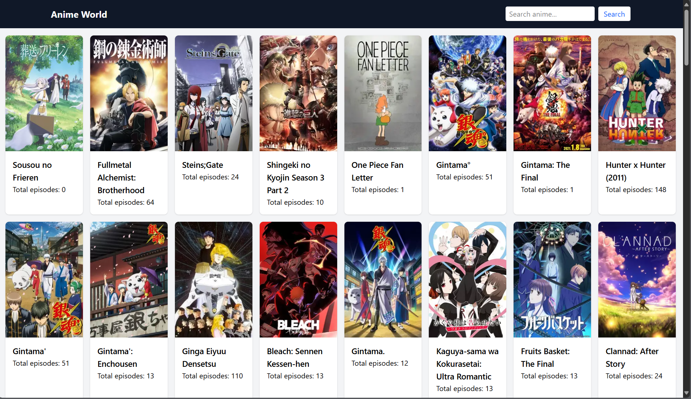
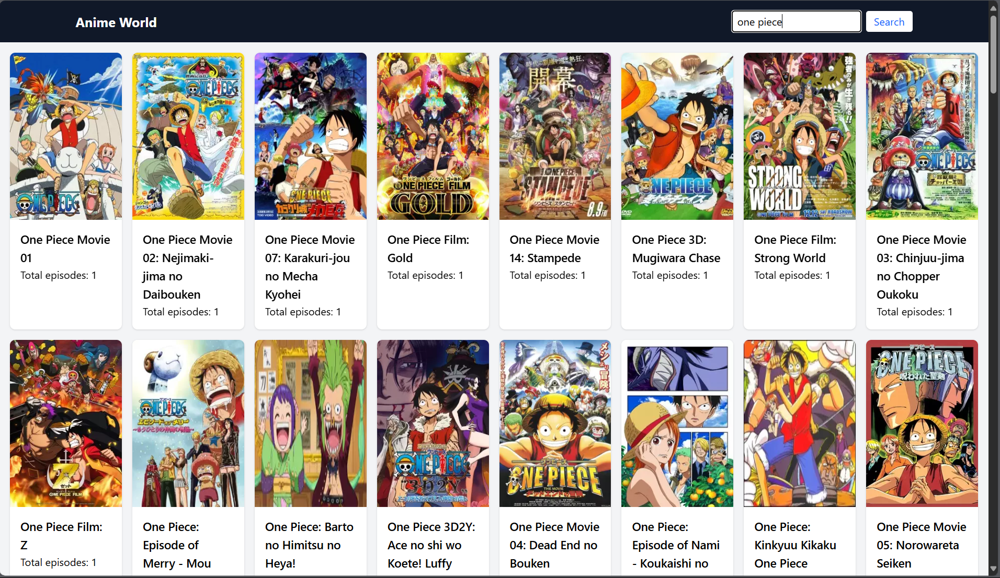
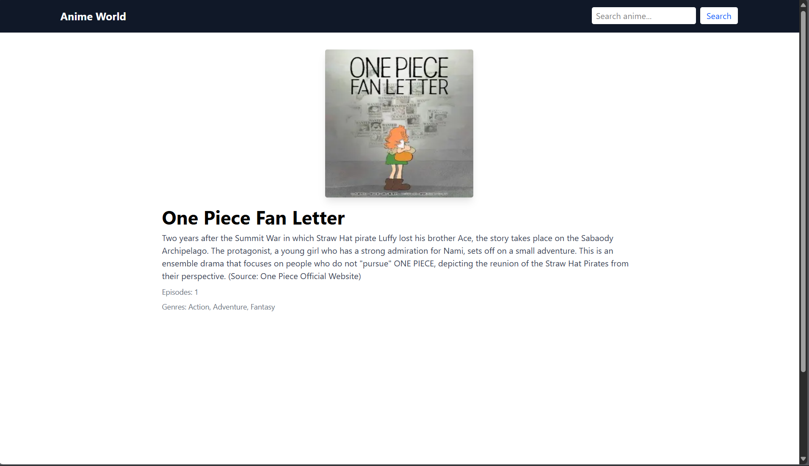

# Anime World 🎥

A React-based anime listing web app inspired by HiAnime Website. It fetches top anime from the [anime-db API](https://rapidapi.com/ericwynne/api/anime-db/) and displays them in a responsive UI. Includes a search feature to find anime by title.

## 📸 Screenshots


*Home Page showing top-ranked anime.*


*Search results for an anime.*


*Detailed view of a selected anime.*

> You can add screenshots in a folder named `/screenshots` in the root of your project.

---

## 🚀 Features

- 🔎 Search anime by name
- 📈 View top 100 anime sorted by ranking
- 📄 Detailed anime view (image, synopsis, episodes, rating)
- 🌐 Responsive design using Tailwind CSS
- ⚡ Fast performance using Vite + React

---

## 🛠 Tech Stack

- [React](https://reactjs.org/)
- [Vite](https://vitejs.dev/)
- [Tailwind CSS](https://tailwindcss.com/)
- [React Router DOM](https://reactrouter.com/)
- [Anime DB API (RapidAPI)](https://rapidapi.com/ericwynne/api/anime-db/)

---

## 📦 Installation

1. **Clone the repository**
   ```bash
   git clone https://github.com/Gowthaman281/Anime_Application.git
   cd Anime_Application
